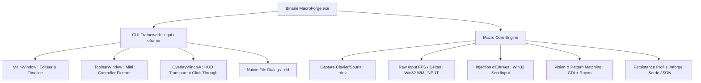

# 🚀 MacroForge — Migration Full Natif Windows

## 🎯 Objectif
Migrer l'intégralité de **MacroForge** d'une architecture hybride (Tauri v2 + WebView2 + Vite / TypeScript / HTML / CSS) vers une application **100% Native Windows en Rust** avec rendu GPU matériel (`egui` / `eframe`).

### ⚡ Bénéfices Clés
- **Suppression totale des composants Web** : Plus aucun runtime navigateur (Edge WebView2), ni serveur Node.js, ni HTML/CSS/DOM.
- **Consommation Mémoire Réduite** : Passage de ~200 Mo de RAM à **< 20 Mo de RAM**.
- **Démarrage Instantané** : Lancement à froid en **< 50 ms**.
- **Réactivité 120+ FPS** : Rendu GPU immédiat sans latence IPC JSON ni overhead de sérialisation.
- **Binaire Unique Autonome** : Un seul exécutable `.exe` portable et ultra-compact.

---

## 📊 Matrice des Issues de Migration (GitHub Tracker)

| GitHub Issue | Titre de l'Issue | Statut | Priorité | Fiche Locale |
|---|---|:---:|:---:|:---:|
| [**#2**](https://github.com/DZTic/MacroForge/issues/2) | Architecture Fondatrice & Setup Standalone (`egui`/`eframe`) | 📝 Ouverte | 🔴 Bloquant | [`ISSUE-01`](./ISSUE-01-architecture-fondatrice.md) |
| [**#3**](https://github.com/DZTic/MacroForge/issues/3) | Thème & Design System Natif (Dark UI / Glassmorphism) | 📝 Ouverte | 🟠 Haute | [`ISSUE-02`](./ISSUE-02-theme-et-design-system-natif.md) |
| [**#4**](https://github.com/DZTic/MacroForge/issues/4) | Vue Principale & Éditeur de Macro (Drag & Drop natif) | 📝 Ouverte | 🔴 Critique | [`ISSUE-03`](./ISSUE-03-vue-principale-editeur-macro.md) |
| [**#5**](https://github.com/DZTic/MacroForge/issues/5) | Modales & Boîtes de Dialogue Natives (Clavier, Souris, Images, RFD) | 📝 Ouverte | 🟠 Haute | [`ISSUE-04`](./ISSUE-04-modales-et-dialogues-natifs.md) |
| [**#6**](https://github.com/DZTic/MacroForge/issues/6) | Toolbar Flottante Native (Mini-contrôleur compact) | 📝 Ouverte | 🟠 Haute | [`ISSUE-05`](./ISSUE-05-toolbar-flottante-native.md) |
| [**#7**](https://github.com/DZTic/MacroForge/issues/7) | Overlay Transparent Click-Through (HUD sans capture GDI) | 📝 Ouverte | 🟠 Haute | [`ISSUE-06`](./ISSUE-06-overlay-transparent-click-through.md) |
| [**#8**](https://github.com/DZTic/MacroForge/issues/8) | Moteur d'Internationalisation Natif (i18n FR / EN) | 📝 Ouverte | 🟡 Moyenne | [`ISSUE-07`](./ISSUE-07-internationalisation-native-i18n.md) |
| [**#9**](https://github.com/DZTic/MacroForge/issues/9) | Nettoyage Stack Web & Optimisations Release Finales | 📝 Ouverte | 🟢 Finale | [`ISSUE-08`](./ISSUE-08-nettoyage-stack-web-et-optimisation-release.md) |

---

## 🛠️ Stack Technique Cible

---

## 🔒 Principes d'Ingénierie & Sécurité
- **Arrêt d'Urgence F4** : Doit interrompre instantanément toute lecture de macro à tout moment.
- **Raccourcis Globaux F8 / F9** : Démarrage et arrêt d'enregistrement toujours réactifs via `rdev`.
- **Thread Safety** : Minimisation absolue du temps de rétention du mutex `MACRO_STATE`.
- **Zéro Régression** : Maintien strict de la précision temporelle absolue et du support Raw Input pour les jeux FPS.
